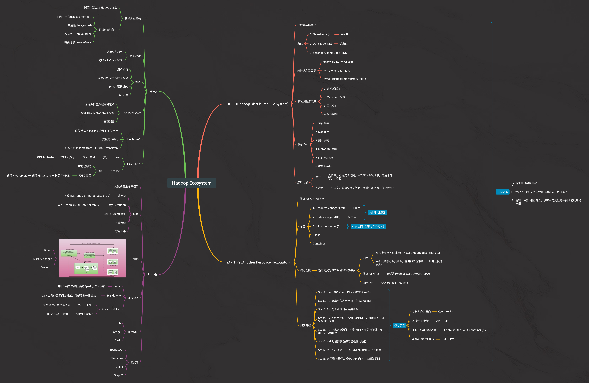

# Hadoop Ecosystem Learning

## Overview

View the original mindmap on [Gitmind](https://gitmind.com/app/docs/mxygow3d).

Subjects including:

- [Apache Hadoop](https://hadoop.apache.org/): HDFS & YARN
- [Apache Hive](https://hive.apache.org/)
- [Apache Spark](https://spark.apache.org/)

## Videos

### Apache Hadoop - HDFS
- [【黑马程序员】大数据Hadoop入门教程-Apache Hadoop、HDFS-05-Apache Hadoop安装部署--集群组成介绍](https://www.youtube.com/watch?v=Im_EEtEucE8&list=PLFbd8KZNbe-_hl4cLftTLwA4THNSLhB10&index=24&ab_channel=%E9%BB%91%E9%A9%AC%E7%A8%8B%E5%BA%8F%E5%91%98)
- [【黑马程序员】大数据Hadoop入门教程-Apache Hadoop、HDFS-11-Apache Hadoop安装部署--初体验](https://www.youtube.com/watch?v=AwyDhNm42Ew&list=PLFbd8KZNbe-_hl4cLftTLwA4THNSLhB10&index=30&ab_channel=%E9%BB%91%E9%A9%AC%E7%A8%8B%E5%BA%8F%E5%91%98)
- [【黑马程序员】大数据Hadoop入门教程-Apache Hadoop、HDFS-13-场景互动：分布式存储系统的核心属性及功能作用](https://www.youtube.com/watch?v=j24b_nN0WKo&list=PLFbd8KZNbe-_hl4cLftTLwA4THNSLhB10&index=32&ab_channel=%E9%BB%91%E9%A9%AC%E7%A8%8B%E5%BA%8F%E5%91%98)
- [【黑马程序员】大数据Hadoop入门教程-Apache Hadoop、HDFS-14-HDFS简介、设计目标与应用场景](https://www.youtube.com/watch?v=0gsaxDRXPBg&list=PLFbd8KZNbe-_hl4cLftTLwA4THNSLhB10&index=33&ab_channel=%E9%BB%91%E9%A9%AC%E7%A8%8B%E5%BA%8F%E5%91%98)
- [【黑马程序员】大数据Hadoop入门教程-Apache Hadoop、HDFS-15-HDFS重要特性解读](https://www.youtube.com/watch?v=sUhjlBru0aE&list=PLFbd8KZNbe-_hl4cLftTLwA4THNSLhB10&index=34&ab_channel=%E9%BB%91%E9%A9%AC%E7%A8%8B%E5%BA%8F%E5%91%98)
- [【黑马程序员】大数据Hadoop入门教程-Apache Hadoop、HDFS-16-HDFS shell命令行解释说明](https://www.youtube.com/watch?v=ZhI823V2-Lw&list=PLFbd8KZNbe-_hl4cLftTLwA4THNSLhB10&index=35&ab_channel=%E9%BB%91%E9%A9%AC%E7%A8%8B%E5%BA%8F%E5%91%98)
- [【黑马程序员】大数据Hadoop入门教程-Apache Hadoop、HDFS-17-HDFS shell命令行常用操作](https://www.youtube.com/watch?v=BmOTLPuNpKo&list=PLFbd8KZNbe-_hl4cLftTLwA4THNSLhB10&index=36&ab_channel=%E9%BB%91%E9%A9%AC%E7%A8%8B%E5%BA%8F%E5%91%98)
- [【黑马程序员】大数据Hadoop入门教程-Apache Hadoop、HDFS-18-HDFS工作流程与机制--各角色职责介绍与梳理](https://www.youtube.com/watch?v=O1_LsrxSomg&list=PLFbd8KZNbe-_hl4cLftTLwA4THNSLhB10&index=37&ab_channel=%E9%BB%91%E9%A9%AC%E7%A8%8B%E5%BA%8F%E5%91%98)

### Apache Hadoop - YARN
- [【黑马程序员】大数据Hadoop入门教程-MapReduce与YARN-01-理解先分再合、分而治之的思想](https://www.youtube.com/watch?v=3JAlhOA1XQY&list=PLFbd8KZNbe-_hl4cLftTLwA4THNSLhB10&index=41&ab_channel=%E9%BB%91%E9%A9%AC%E7%A8%8B%E5%BA%8F%E5%91%98)
- [【黑马程序员】大数据Hadoop入门教程-MapReduce与YARN-05-Hadoop MapReduce官方示例-WordCount单词统计](https://www.youtube.com/watch?v=efOF9KEoKvQ&list=PLFbd8KZNbe-_hl4cLftTLwA4THNSLhB10&index=45&ab_channel=%E9%BB%91%E9%A9%AC%E7%A8%8B%E5%BA%8F%E5%91%98)
- [【黑马程序员】大数据Hadoop入门教程-MapReduce与YARN-09-Hadoop YARN-功能介绍-资源管理、任务调度](https://www.youtube.com/watch?v=l6T3QfDlyMA&list=PLFbd8KZNbe-_hl4cLftTLwA4THNSLhB10&index=49&ab_channel=%E9%BB%91%E9%A9%AC%E7%A8%8B%E5%BA%8F%E5%91%98)
- [【黑马程序员】大数据Hadoop入门教程-MapReduce与YARN-10-Hadoop YARN-架构图、3大组件介绍](https://www.youtube.com/watch?v=Hp1NevritI4&list=PLFbd8KZNbe-_hl4cLftTLwA4THNSLhB10&index=50&ab_channel=%E9%BB%91%E9%A9%AC%E7%A8%8B%E5%BA%8F%E5%91%98)
- [【黑马程序员】大数据Hadoop入门教程-MapReduce与YARN-11-Hadoop YARN-程序提交YARN集群交互流程](https://www.youtube.com/watch?v=GWY9jgmTa2Y&list=PLFbd8KZNbe-_hl4cLftTLwA4THNSLhB10&index=51&ab_channel=%E9%BB%91%E9%A9%AC%E7%A8%8B%E5%BA%8F%E5%91%98)

### Apache Hive
- [【黑马程序员】大数据Hadoop入门教程-数据仓库基础与ApacheHive入门-01-数据仓库概念与起源发展由来](https://www.youtube.com/watch?v=nJ5yjD2r0uY&list=PLFbd8KZNbe-_hl4cLftTLwA4THNSLhB10&index=54&ab_channel=%E9%BB%91%E9%A9%AC%E7%A8%8B%E5%BA%8F%E5%91%98)
- [【黑马程序员】大数据Hadoop入门教程-数据仓库基础与ApacheHive入门-02-数据仓库主要特征-面向主题、集成、非易失、时变](https://www.youtube.com/watch?v=HGlqlZLlt7w&list=PLFbd8KZNbe-_hl4cLftTLwA4THNSLhB10&index=55&ab_channel=%E9%BB%91%E9%A9%AC%E7%A8%8B%E5%BA%8F%E5%91%98)
- [【黑马程序员】大数据Hadoop入门教程-数据仓库基础与ApacheHive入门-04-Apache hive软件介绍与Hadoop关系](https://www.youtube.com/watch?v=4x3mrchUbiA&list=PLFbd8KZNbe-_hl4cLftTLwA4THNSLhB10&index=57&ab_channel=%E9%BB%91%E9%A9%AC%E7%A8%8B%E5%BA%8F%E5%91%98)
- [【黑马程序员】大数据Hadoop入门教程-数据仓库基础与ApacheHive入门-05-场景设计-Hive功能模拟实现底层猜想](https://www.youtube.com/watch?v=67KWo-K1mmU&list=PLFbd8KZNbe-_hl4cLftTLwA4THNSLhB10&index=58&ab_channel=%E9%BB%91%E9%A9%AC%E7%A8%8B%E5%BA%8F%E5%91%98)
- [【黑马程序员】大数据Hadoop入门教程-数据仓库基础与ApacheHive入门-06-Apache hive-架构图、各组件功能](https://www.youtube.com/watch?v=NbT4aPwmV_s&list=PLFbd8KZNbe-_hl4cLftTLwA4THNSLhB10&index=59&ab_channel=%E9%BB%91%E9%A9%AC%E7%A8%8B%E5%BA%8F%E5%91%98)
- [【黑马程序员】大数据Hadoop入门教程-数据仓库基础与ApacheHive入门-07-Apache hive安装部署-metadata与metastore、远程模式介绍](https://www.youtube.com/watch?v=fj1EWS8MhZc&list=PLFbd8KZNbe-_hl4cLftTLwA4THNSLhB10&index=60&ab_channel=%E9%BB%91%E9%A9%AC%E7%A8%8B%E5%BA%8F%E5%91%98)
- [【黑马程序员】大数据Hadoop入门教程-数据仓库基础与ApacheHive入门-11-Apache hive-新老客户端使用与hiveserver2服务](https://www.youtube.com/watch?v=1zsQA7amwUo&list=PLFbd8KZNbe-_hl4cLftTLwA4THNSLhB10&index=64&ab_channel=%E9%BB%91%E9%A9%AC%E7%A8%8B%E5%BA%8F%E5%91%98)
- [【黑马程序员】大数据Hadoop入门教程-数据仓库基础与ApacheHive入-13-Apache hive-数据库与建库、切换库操作](https://www.youtube.comwatch?v=50rjRw3my3E&list=PLFbd8KZNbe-_hl4cLftTLwA4THNSLhB10index=66ab_channel=%E9%BB%91%E9%A9%AC%E7%A8%8B%E5%BA%8F%E5%91%98)
- [【黑马程序员】大数据Hadoop入门教程-数据仓库基础与ApacheHive入门-14-Apache hive-表与建表sql语句-数据类型、分隔符指定语法](https://www.youtube.com/watch?v=iJgPqBmhhgM&list=PLFbd8KZNbe-_hl4cLftTLwA4THNSLhB10&index=68&ab_channel=%E9%BB%91%E9%A9%AC%E7%A8%8B%E5%BA%8F%E5%91%98)
- [【黑马程序员】大数据Hadoop入门教程-数据仓库基础与ApacheHive入门-16-Apache hive-常见的show语法](https://www.youtube.com/watch?v=hPrnhWApJkk&list=PLFbd8KZNbe-_hl4cLftTLwA4THNSLhB10&index=69&ab_channel=%E9%BB%91%E9%A9%AC%E7%A8%8B%E5%BA%8F%E5%91%98)
- [【黑马程序员】大数据Hadoop入门教程-Apache Hive DML语句与函数使用-01-Hive-SQL-DML-Load加载数据操作](https://www.youtube.com/watch?v=DSlxybgGFj8&list=PLFbd8KZNbe-_hl4cLftTLwA4THNSLhB10&index=72&ab_channel=%E9%BB%91%E9%A9%AC%E7%A8%8B%E5%BA%8F%E5%91%98)
- [【黑马程序员】大数据Hadoop入门教程-Apache Hive DML语句与函数使用-02-Hive-SQL-DML-Insert插入数据](https://www.youtube.com/watch?v=AzGWohds6yM&list=PLFbd8KZNbe-_hl4cLftTLwA4THNSLhB10&index=73&ab_channel=%E9%BB%91%E9%A9%AC%E7%A8%8B%E5%BA%8F%E5%91%98)
