# Hive

---

[【黑马程序员】大数据Hadoop入门教程-数据仓库基础与ApacheHive入门-01-数据仓库概念与起源发展由来](https://www.youtube.com/watch?v=nJ5yjD2r0uY&list=PLFbd8KZNbe-_hl4cLftTLwA4THNSLhB10&index=54&ab_channel=%E9%BB%91%E9%A9%AC%E7%A8%8B%E5%BA%8F%E5%91%98)

## 數據倉庫基本概念

### 數據倉庫  (Data Warehouse, DW)

- 一套**用於儲存、分析、報告的數據系統**。
- 目的: 建構**面向分析**的集成化數據環境。


- 數據倉庫本身**不生產**任何數據，數據來自不同外部系統。
- 數據倉庫本身**不消費**任何數據，結果開放給各外部應用。

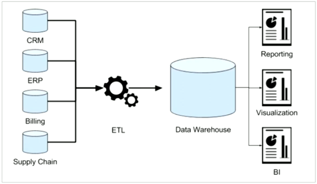

## 場景案例：數據倉庫為何而來

- 為了**分析數據而來**。

### 範例：中國人壽保險公司

1. 業務數據的存儲問題
    - 業務正常運營需要記錄客戶、保單、收付費、核保、理賠等訊息，**業務數據儲存在哪**？
    - **聯機事務處理系統 (OLTP)**: **前台接收的用戶數據可以立即傳到後台處理，並在很短的時間內給出處理結果**。
    - **關聯型數據庫 (RDBMS)** 是 OLTP 典型應用，如 Oracle、MySQL、SQL Server 等。
        
        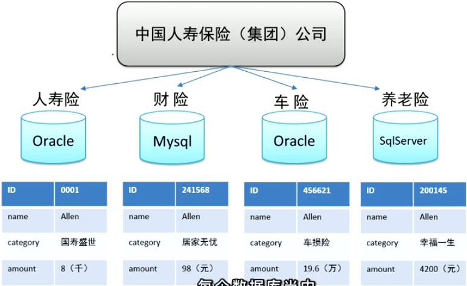

2. 分析型決策的制定
    - **基於業務數據展開數據分析，基於分析的結果支撐決策**，即**數據驅動決策的制定 (Data-driven Decision Making)**。
    - OLTP環境展開數據分析可行嗎？→ **可以，但沒必要。**
        - OLTP 通常**讀的壓力明顯大於寫的壓力**。
        - 數據分析也是對數據進行讀取操作，讓**讀取壓力倍增**。
        - OLTP **僅儲存數週或數月的數據**。
        - **數據分散**在不同系統不同表中，字段類型屬性不統一。
    - 數據倉庫面世
        - 更好地進行各種規模的數據分析，同時也不影響 OLTP 系統運行，需要建構一個集成統一的數據分析平台。
        - 目的: 面向分析、支持分析。
    - 數據倉庫的建構

        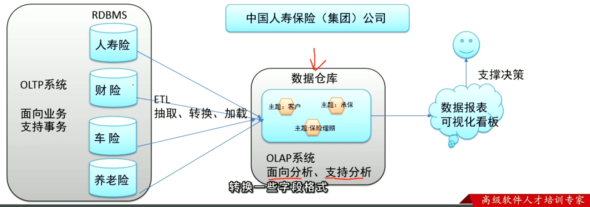
        

---

[【黑马程序员】大数据Hadoop入门教程-数据仓库基础与ApacheHive入门-02-数据仓库主要特征-面向主题、集成、非易失、时变](https://www.youtube.com/watch?v=HGlqlZLlt7w&list=PLFbd8KZNbe-_hl4cLftTLwA4THNSLhB10&index=55&ab_channel=%E9%BB%91%E9%A9%AC%E7%A8%8B%E5%BA%8F%E5%91%98)

## 數據倉庫主要特徵 ⭐️

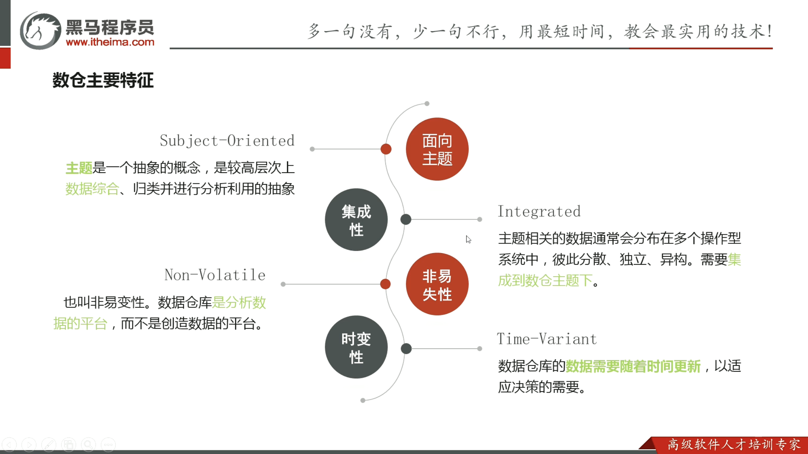

1. **面向主題 (Subject-oriented)**

    抽象概念，**數據綜合**。
    
    - **開始數據分析的時候要確認主題**。

2. **集成性 (Integrated)**

    數據通常會分布在多個操作型系統，彼此**分散、獨立、異構**。需**要集成到數據倉主題下**。

    - 數據進入倉庫前，必然要經過統一與綜合，對數據進行**抽取、清理、轉換和匯總**。
        - 統一源數據中所有**矛盾之處**。例如: 同名異義、異名同義、單位不統一、字長不一致等。
        - 進行數據**綜合與計算**。
        - **抽取、轉換、加載 → Extract, Transform, Load (ETL)**
  
3. **非易失性 (Non-volatile)**

    又稱**非易變性**。**數據倉庫是分析數據的平台，不是創造數據的平台**。

    - 數據倉庫的數據反映的是一段相當長的時間內歷史數據的內容。
    - 數據倉庫中一般有**大量的查詢操作**，但修改和刪除操作很少。

4. **時變性 (Time-variant)**

    數據倉庫的數據需要**隨著時間更新**，以適應決策的需要。
    
    - 數據倉庫包含各種顆粒度 (日期、星期、月份、季度、年份) 的歷史數據。
    - 數據倉庫建設是**一個項目，一個過程**。

---

[【黑马程序员】大数据Hadoop入门教程-数据仓库基础与ApacheHive入门-04-Apache hive软件介绍与Hadoop关系](https://www.youtube.com/watch?v=4x3mrchUbiA&list=PLFbd8KZNbe-_hl4cLftTLwA4THNSLhB10&index=57&ab_channel=%E9%BB%91%E9%A9%AC%E7%A8%8B%E5%BA%8F%E5%91%98)

## 什麼是 Hive?

- Apache Hive 是一款建立在 Hadoop 之上的開源**數據倉庫**系統。
- 可將儲存在 Hadoop 文件中的**結構化、半結構化數據文件映射為一張數據庫表**。
- 就可以用類似 SQL 的查詢模型，稱為 **Hive 查詢語言 (HQL)**，用於訪問和分析儲存在 Hadoop 文件中的大型數據集。
- Hive 核心是**將 HQL 轉換為 MapReduce 程序**，並將程序提交到 Hadoop 叢集執行。

## 為什麼使用 Hive?

- 使用 Hadoop MapReduce 直接處理數據面臨的問題
    - 人員學習成本太高，需要掌握 JAVA 語言。
    - MapReduce 實現查詢邏輯開發難度太大。
- 使用 Hive 處理數據的好處
    - 接口採用**類 SQL 語法** → 簡單、容易上手
    - 避免直接寫 MapReduce → 減少開發人員學習成本
    - 支援自訂義函數 → 功能擴展很方便
    - 背靠 Hadoop → 擅長存儲分析海量數據

## Hive 和 Hadoop 的關係

- 數據倉庫軟體至少需要具備兩種能力:
    1. **存儲**數據的能力。
    2. **分析**數據的能力。
- Hive 借助 Hadoop 實現上述兩種能力
    - **HDFS: 存儲數據**。
    - **MapReduce: 查詢分析數據**。
- Hive: 用戶專注編寫 HQL，Hive 將 HQL 轉換成 MapReduce 程序完成數據分析 (SQL on Hadoop)。

---

[【黑马程序员】大数据Hadoop入门教程-数据仓库基础与ApacheHive入门-05-场景设计-Hive功能模拟实现底层猜想](https://www.youtube.com/watch?v=67KWo-K1mmU&list=PLFbd8KZNbe-_hl4cLftTLwA4THNSLhB10&index=58&ab_channel=%E9%BB%91%E9%A9%AC%E7%A8%8B%E5%BA%8F%E5%91%98)

## 場景設計: 如何模擬實現 Hive 功能

- 範例: 在 HDFS 文件系統上有一個文件，路徑為 `/data/china_user.txt` 。需求: 統計來自於上海年齡大於 25 歲的用戶有多少個？

    ```
    1,zhangsan,18,beijing
    2,lisi,25,shanghai
    3,allen,30,shanghai
    4,wangwu,15,nanjing
    5,james,45,hangzhou
    6,tony,26,beijing
    ```

### 重點

1. Hive 能將數據文件**映射**成為一張表。
2. Hive 軟體本身承擔的**功能職責**。

### 1. 映射訊息記錄

- 在 Hive 中**能夠寫 SQL 處理的前提是針對表，不是針對文件**，因此需要將**文件和表之間的對應關係**描述清楚。
- 映設訊息稱為**元數據訊息**，要記錄的元數據訊息包括:
    - 表對應著哪個文件 (位置訊息)
    - 表的列對應著文件哪一個字段 (順序訊息)
    - 文件字段之間的分隔符號是什麼

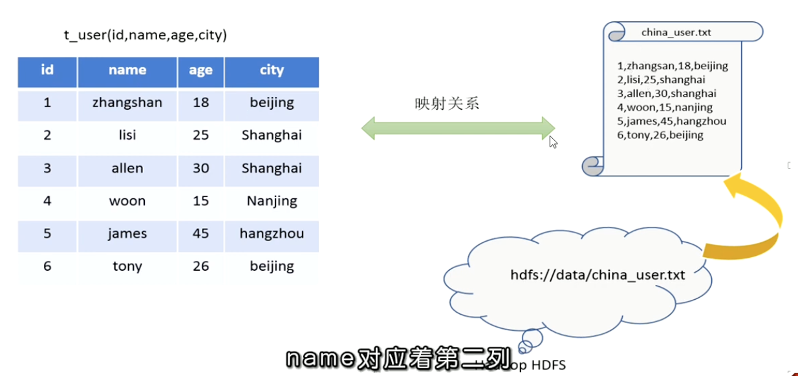

### 2. SQL 語法解析、編譯

- 用戶寫完 SQL 後，Hive 針對 SQL 進行語法校驗，並根據元數據信息解讀 SQL 背後的含義，制定執行計畫。
- 把計畫轉成 MapReduce 程序來具體執行，把執行結果封裝返回給用戶。

### 3. 最終效果

基於上述分析，最終想要模擬實現的 Hive 功能，大致需要下圖所示組建參與其中。

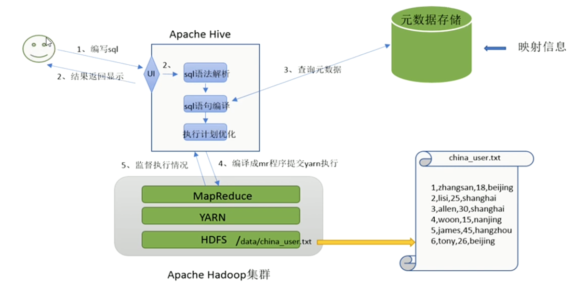

- 使用者
    - 寫 SQL
    - 看結果
- 建表: 將元數據映設訊息寫好
    - 表對應哪個文件
    - 分隔符號
- Hive
    - SQL 語法解析
    - SQL 語法編譯
    - 執行計畫優化
- 任務送到 YARN

---

[【黑马程序员】大数据Hadoop入门教程-数据仓库基础与ApacheHive入门-06-Apache hive-架构图、各组件功能](https://www.youtube.com/watch?v=NbT4aPwmV_s&list=PLFbd8KZNbe-_hl4cLftTLwA4THNSLhB10&index=59&ab_channel=%E9%BB%91%E9%A9%AC%E7%A8%8B%E5%BA%8F%E5%91%98)

## Hive 架構圖

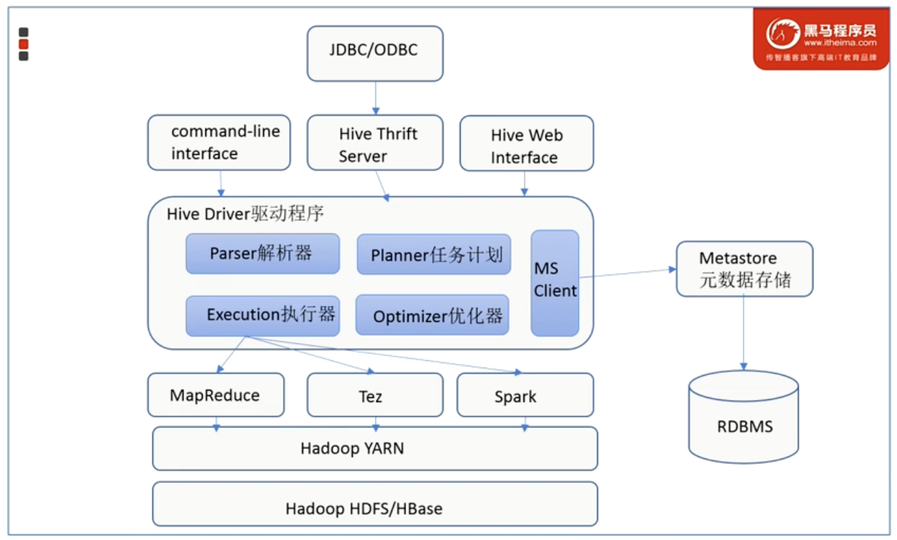

- 用戶接口
    - 包括 CLI、JDBC (JAVA 的一種協議)、WebGUI。
- 映設訊息/元數據存儲
    - 通常是儲存在關連數據庫如 mysql/derby 中。
- Driver 驅動程式
    - 包括語法解析器、計畫編譯器、優化器、執行器。
- 執行引擎
    - Hive 本身不直接處理數據文件，而是透過執行引擎處理。
    - 如: MapReduce (太慢)、Tez、Spark 等。

---

[【黑马程序员】大数据Hadoop入门教程-数据仓库基础与ApacheHive入门-07-Apache hive安装部署-metadata与metastore、远程模式介绍](https://www.youtube.com/watch?v=fj1EWS8MhZc&list=PLFbd8KZNbe-_hl4cLftTLwA4THNSLhB10&index=60&ab_channel=%E9%BB%91%E9%A9%AC%E7%A8%8B%E5%BA%8F%E5%91%98)

## Hive Metadata

- **元數據**，描述數據的數據。
- 儲存在關聯型數據庫中。

## Hive Metastore

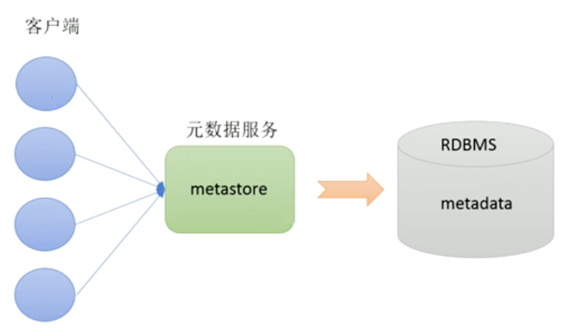

- **元數據服務**，管理元數據。
- 有了 Meatastore，就可以有多個客戶端同時連接，而且客戶端不需要知道 MySQL 數據庫的用戶名，只需要連接 Metastore 服務。保障了 Hive 元數據的安全。
- Metastore 配置有三種模式:
    - 內嵌模式、本地模式、**遠程模式**。
        
        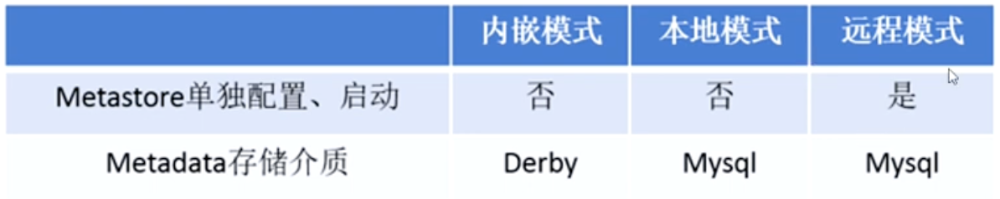
        

---

[【黑马程序员】大数据Hadoop入门教程-数据仓库基础与ApacheHive入门-11-Apache hive-新老客户端使用与hiveserver2服务](https://www.youtube.com/watch?v=1zsQA7amwUo&list=PLFbd8KZNbe-_hl4cLftTLwA4THNSLhB10&index=64&ab_channel=%E9%BB%91%E9%A9%AC%E7%A8%8B%E5%BA%8F%E5%91%98)

## Hive 自帶客戶端 ⭐️

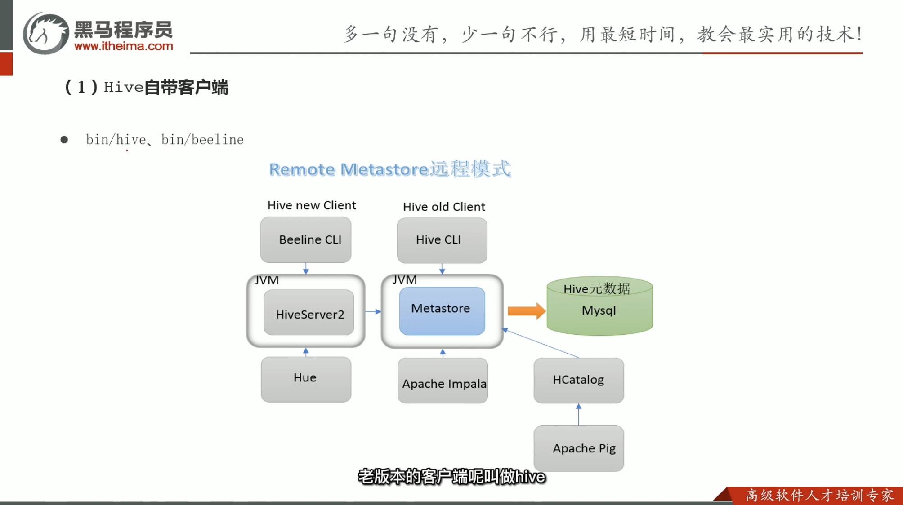

- 老版本 - bin/hive (Shell 實現) → 訪問 Metastore → 訪問 Mysql
- 新版本 - bin/beeline (JDBC 實現) → 訪問 HiveServer2 → 訪問 Metastore → 訪問 Mysql

## HiveServer2服務介紹

- **遠程模式下 Beeline 通過 Thrift 連接到單獨的 HiveServer2 服務上**。
- HiveServer2 支援多客戶端的開發和身份驗證，只在為開放 API 客戶端如 JDBC、ODBC 提供更好的支持。
- **必須先啟動 Metastore，再啟動 HiveServer2。**
    
    ```
    # 啟動 Hive
    nohup /export/servers/hive/bin/hive --service metastore &
    nohup /export/servers/hive/bin/hive --service hiveserver2 &
    
    # 連接 Hive
    ! connect jdbc:hive2://node1:10000
    ```
    
    ## 關係梳理
    
    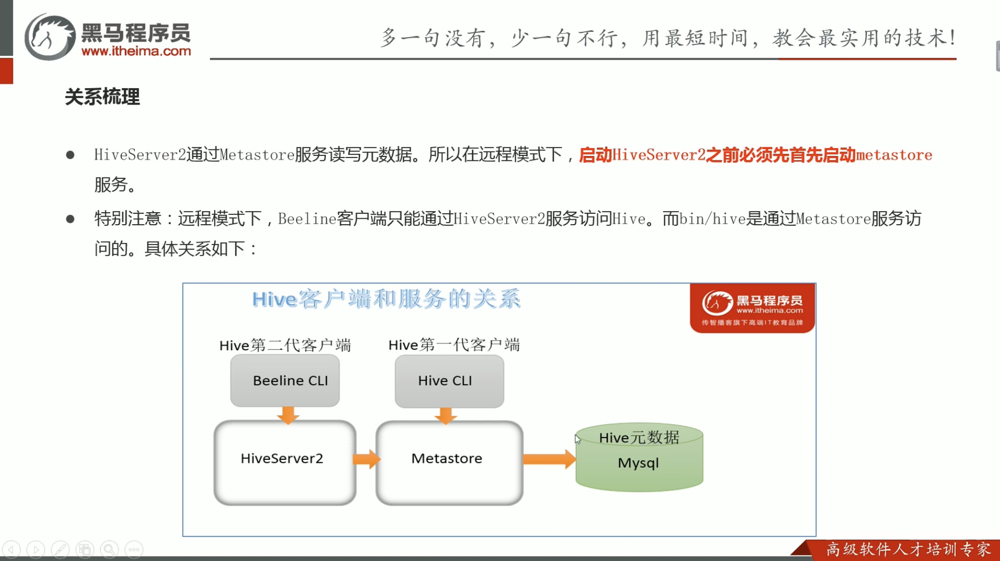
    
    - Hive 第二代客戶端: Beeline CLI → 訪問 HiveServer2  → 訪問 Metastore → 訪問 Mysql
    - Hive 第一代客戶端: Hive CLI → 訪問 Metastore → 訪問 Mysql
    
---

[【黑马程序员】大数据Hadoop入门教程-数据仓库基础与ApacheHive入-13-Apache hive-数据库与建库、切换库操作](https://www.youtube.comwatch?v=50rjRw3my3E&list=PLFbd8KZNbe-_hl4cLftTLwA4THNSLhB10index=66ab_channel=%E9%BB%91%E9%A9%AC%E7%A8%8B%E5%BA%8F%E5%91%98)

## Hive 數據模型總覽

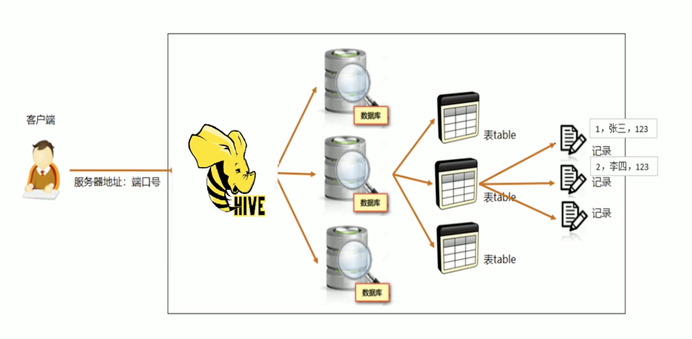
    
- 數據庫間隔離，下面有很多表，表下有很多數據。
- 表是管理數據的幾本單位。

## SQL 中 DDL 語法的作用

- **數據定義語言 (Data Definition Language, DDL)** 是 SQL 語言及中對**數據庫**內部的**對象結構進行創建、刪除、修改**等語言操作。
- 核心語法由 CREATE、ALTER、DROP 三個所組成。
- DDL 不涉及表內部數據的操作，只針對結構進行操作。

## Hive 中 DDL 語法的使用

- 基於 Hive 的設計，HQL 中 CREATE 語法 (尤其 Create Table) 是學習掌握 Hive DDL 的重點
    - **建表成功會直接影響數據文件是否映射成功**。

## 數據庫 Database

- 預設數據庫為 `default` ，位於 HDFS `/user/hive/warehouse` 下。
- 用戶自己創建的數據庫位於 `/user/hive/warehouse/database_name.db` 下。

### 創建新的數據庫

```sql
create database itheima;
```

### 選擇特定數據庫

```sql
use itheima;
```

切換當前使用哪個數據庫。

### 刪除數據庫

```sql
drop database itheima;
```

預設行為是 `RESTRICT`，僅在數據庫為空時才刪除。要刪除有表的數據庫要使用 `CASCADE`。

---

[【黑马程序员】大数据Hadoop入门教程-数据仓库基础与ApacheHive入门-14-Apache hive-表与建表sql语句-数据类型、分隔符指定语法](https://www.youtube.com/watch?v=iJgPqBmhhgM&list=PLFbd8KZNbe-_hl4cLftTLwA4THNSLhB10&index=68&ab_channel=%E9%BB%91%E9%A9%AC%E7%A8%8B%E5%BA%8F%E5%91%98)

## 表 Table

- 每一個表由一個名字標示。
- 表包含帶有數據的紀錄 (行)。
- 分割符號。

## 建表語法

```sql
create table [if not exists] [db_name.]table_name
(col_name data_type [COMMENT col_comment], ...)
[COMMENT table_comment]
[ROW FORMAT DELIMITED ...]
```

- 建表語法順序要和語法樹中順序保持一致。

## 1. 數據類型

- 整體分為兩類
    1. 原生數據類型 (Primitive data type): Numeric, String, Date Time, Miscellaneous
    2. 複雜數據類型 (Complex data type): Arrays, Maps, Structs, Union

## 2. 分隔符指定語法

- 包含四種狀況的分隔符號:
    1. 字段之間: `fields terminated by [char]`
    2. 集合元素之間: `collection items terminated by [char]`
    3. Map 映射 kv 之間: `map keys terminated by [char]`
    4. 換行: `lines terminated by [char]`

## Hive 建表基礎語法練習

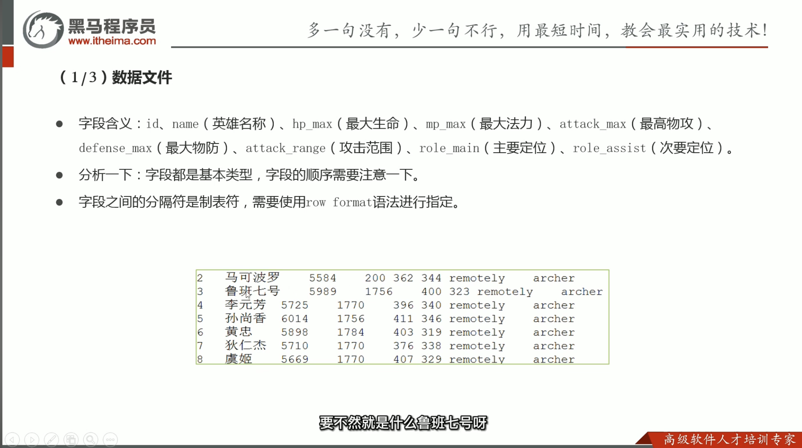

→ **Data Grip**

### 建表

```sql
create table itheima.t_archer(
	id int comment "ID編號",
  name string comment "英雄名稱",
	hp_max int comment "最大生命",
	mp_max int comment "最大法力",
	attack_max int comment "最高物攻",
	defense_max int comment "最大物防",
	...
)
row format delimited
fields terminated by "\t"
```

### 查表

```sql
select * from t_archer;
```

---

[【黑马程序员】大数据Hadoop入门教程-数据仓库基础与ApacheHive入门-16-Apache hive-常见的show语法](https://www.youtube.com/watch?v=hPrnhWApJkk&list=PLFbd8KZNbe-_hl4cLftTLwA4THNSLhB10&index=69&ab_channel=%E9%BB%91%E9%A9%AC%E7%A8%8B%E5%BA%8F%E5%91%98)

## Show 語法

```sql
# 顯示所有數據庫 schemas 和 databases 的用法、功能一樣
show databases;
show schemas;

# 顯示當前數據庫所有表
show tables;
show tables [in database_name];

# 查詢顯示一張表的元數據訊息
desc formatted t_team_ace_player;
```

---

[【黑马程序员】大数据Hadoop入门教程-Apache Hive DML语句与函数使用-01-Hive-SQL-DML-Load加载数据操作](https://www.youtube.com/watch?v=DSlxybgGFj8&list=PLFbd8KZNbe-_hl4cLftTLwA4THNSLhB10&index=72&ab_channel=%E9%BB%91%E9%A9%AC%E7%A8%8B%E5%BA%8F%E5%91%98)

## Load 語法功能

將數據文件移動到與 Hive 表對應的位置，**移動時是純複製、移動操作**。Hive 不會對表中的數據內容進行任何轉換、操作。

```sql
load data [local] inpath 'filepath' [overwrite] into table table_name;
```

- 若有指定 `local` ，將在本地文件系統中查找文件路徑。沒有指定 `local` ，當 `filepath` 指向的是一個完整的 URI，會直接使用這個 URI。
    
    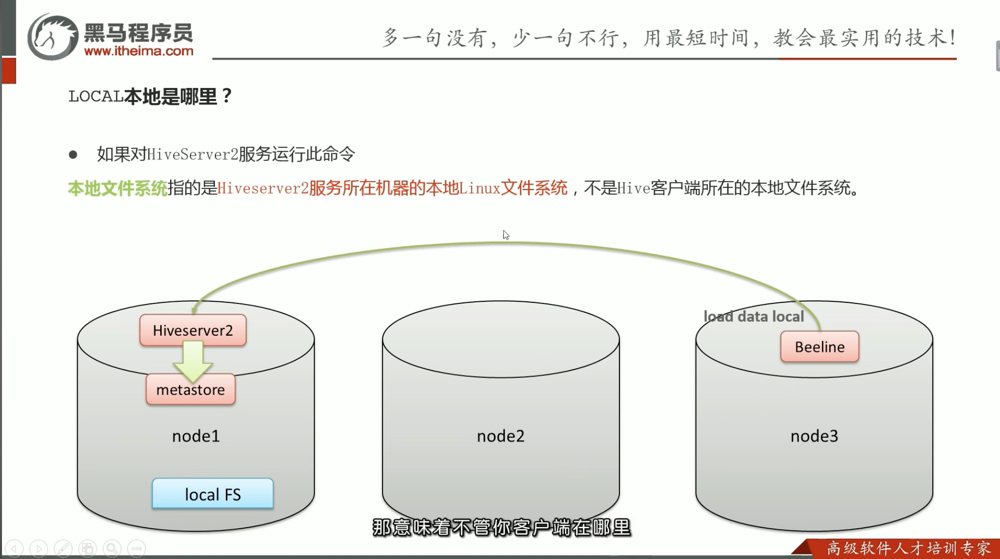
    
- 若沒有指定 `schema` ，Hive 會使用在 Hadoop 配置文件中參數 `[fs.default.name](http://fs.default.name)` 指定的 (幾乎都是 HDFS)。

---

[【黑马程序员】大数据Hadoop入门教程-Apache Hive DML语句与函数使用-02-Hive-SQL-DML-Insert插入数据](https://www.youtube.com/watch?v=AzGWohds6yM&list=PLFbd8KZNbe-_hl4cLftTLwA4THNSLhB10&index=73&ab_channel=%E9%BB%91%E9%A9%AC%E7%A8%8B%E5%BA%8F%E5%91%98)

## Insert 語法功能

- Hive 官方推薦加載數據的方式:
    
    清理數據成結構化文件，**再使用 Load 語法加載數據到表中**。
    

```sql
insert into table t_2 values(1, "zhangsan")
```

### Insert + Select

- 將後面查詢返回的結果作為內容插入到指定表中。
    - 需要保證查詢結果的列數目和需要插入數據表格的列數目一致。
    - 如果查詢出來的數據類型和插入表格對應的列數據類型不一致，將會進行轉換，但不能保證一定轉換成功，轉換失敗的數據會是 `NULL` 。

```sql
insert into table table_name select_statement1 from from_statement;
```

---

## 湖倉一體

- vs Hive，在儲存 data 到 HDFS 的時候，不用一開始就指定表的格式。湖倉一體可以自由決定要先決定表的格式或是後面要用的時候再指定。