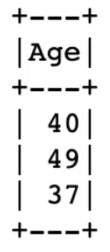
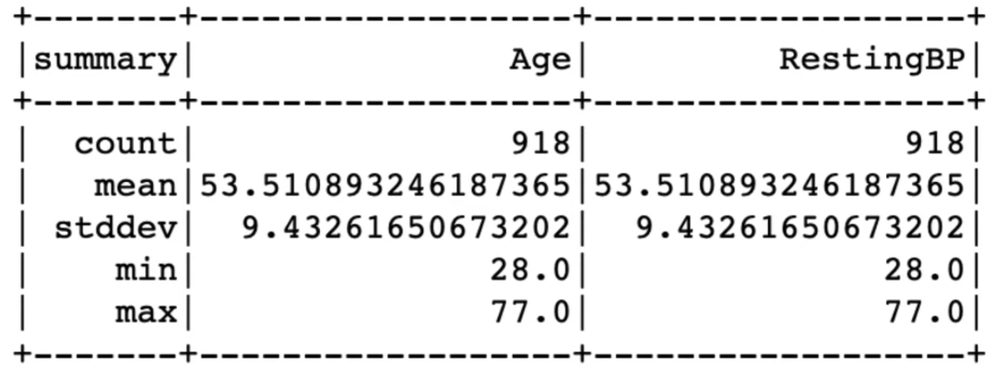
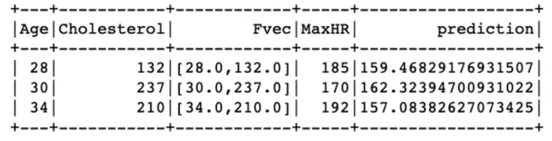

# Spark

---

[What exactly is Apache Spark? | Big Data Tools](https://www.youtube.com/watch?v=ymtq8yjmD9I&ab_channel=nullQueries)

## History of Spark


- 2009 - Developed by a lab in Berkeley University
- 2010 - Open source
- 2013 - Given to Apache Foundation
- 2014 - Designated as a top-level project

## Goal of Spark

- Provide **fast**, **general-purpose cluster framework** for **large-scale data processing**
- **Overcome the limitations of MapReduce**

## Architecture of Spark

- Based on **Resilient Distributed Data** (RDD, 彈性分散式資料集)

### **Resilient Distributed Data (RDD)**

- A programming abstraction that represents a collection of read-only objects split across a computing cluster
- The processing in RDD is done entirely **in memory**
- RDD can be created from text files, SQL databases, No-SQL databases, HDFS, cloud storage
- RDD allows: standard MapReduce functions, joining datasets, filtering, aggregation
- Designed to **hide complexity** from users
    - Users don’t have to worry about:
        - where specific files are sent
        - what resources are used to store and retrieve files

### Processing of an RDD  (Core Spark)


1. **Driver**
    - Create **SparkContext**: an orchestrator that considers the code and determines the possible tasks to be performed
    - Generate a physical plan and then use the **Cluster Manager** to coordinate all of the Executors to schedule and run the tasks
    - **Directed Acyclic Graph (DAG) Scheduler**: Assign tasks and the order to execute them out to the **Worker Node**
2. **Executor**
    - On the **Worker Node**
    - Dynamically launched by the **Cluster Manager**
    - Run a task and return the result to the **Driver**

## Libraries of Spark


- Allow developers to easily interact with the **Core Spark**.
- Including:
    1. **Spark SQL** - structured data and data frames (interacted with SQL, Hive, Java, Python or Scala
    2. **Streaming** - ingesting small data batches or micro batching to achieve new real-time data streams
    3. **MLLib** - distributed machine learning framework
    4. **GraphX** - distributed graph processing

## Platforms of Spark


## Features of Spark

1. **Speed**
    - RDD design
    - In-memory processing
2. **Flexible on programmability**
    - SQL
    - Java
    - Scala
    - Python
3. **Near real-time data processing**
4. **Advanced analytics**
    - R
    - SQL
    - Graphs
    - Machine learning

---

[The ONLY PySpark Tutorial You Will Ever Need.](https://www.youtube.com/watch?v=cZS5xYYIPzk&ab_channel=MoranReznik)

## What is Spark?

A system designed for working, analyzing, and modeling with immense amounts of data in many computers at the same time.

Spark allows you to run computations in parallel instead of sequentially.

It allows you to divided a large task into many smaller tasks and run each task on a different machine.

You can accomplish your analysis goals in a reasonable time that would not  be possible on a single machine.

## What is PySpark?

Python API for working with Spark.

## Important concepts

- Distributed computing
- Cluster
- Resilient distributed dataset (RDD)

## Libraries of Spark

1. Spark SQL + DataFrames (will be covered in this video)
2. Streaming
3. **MLLib** (will be covered in this video)
4. GraphX

## Spark Architecture


1. Initiate a **SparkSession**
    - An object for interacting with Spark
    - Each user of the cluster will have its own SparkSession, allowing the user to use the cluster in **isolation from other users**
2. SparkSession communicates with **SparkContext** (the master node in the cluster)
    - Assigns tasks to the computers in the cluster and coordinates them
3. Master Node gets the computing power of the Worker Nodes in the cluster via **Cluster Manager**
    - Responsible for distributing the cluster’s resources
4. **Executable programs** that run the tasks within the **Worker Nodes**
    - Run multiple tasks simultaneously
    - Cache for storing the results

## Usage

### Initiating a SparkSession

```python
from pyspark.sql import SparkSession

spark = SparkSession.builder.appName('test').getOrCreate()
```

### Session Details

```python
spark
```


- `local[*]` : Spark is using all of the machine cores

### Loading Data

```python
# all of the datatype will be STRING
df = spark.read.option('header', 'true').csv('/dir/to/data.csv')

# assign column names & column types
schema = 'Age INTEGER, Sex STRING, ChestPainType STRING'
df = spark.read.csv('/dir/to/data.csv', schema=schema, header=True)

# use column type defined by spark itself
df = spark.read.csv('/dir/to/data.csv', inferschema=True, header=True)

# replace null value with 'NA'
df = spark.read.csv('/dir/to/data.csv', nullValue='NA')
```

### Saving Data

```python
df.write.format('csv').save('/dir/to/data.csv') # can't overwrite an existing file

# overwrite an existing file
df.write.format('csv').mode('overwrite').save('/dir/to/data.csv')
```

### Counting Number of Rows

```python
df.count()
```

### Show First Few Rows of Table

```python
# show first 3 rows
df.show(3)

# show first 3 rows of 'Age'
df.select('Age').show(3)

# show first 3 rows of 'Age' & 'Sex'
df.select(['Age', 'Sex']).show(3)
```





### Pandas DataFrame vs PySpark DataFrame

- PySpark DataFrame supports distributed computations

### PySpark dataframe to Pandas dataframe

```python
pd_df = df.toPandas()
```

### Pandas dataframe to PySpark dataframe

```python
spark_df = spark.createDataFrame(pd_df)
```

### Column Data types

```python
df.printSchema()
df.dtypes()
```


### Change Column Data Types

```python
from pyspark.sql.types import FloatType

df = df.withColumn('Age', df.Age.cast(FloatType()))
```

### Remove Column

```python
df.drop('AgeFixed')
```

### Rename Column

```python
df.withColumnRenamed('Age', 'age')
```

### Rename Multiple Column

```python
name_pairs = [('Age', 'age'), ('Sex', 'sex')]
for old_name, new_name in name_pairs:
	df = df.withColumnRenamed(old_name, new_name)
```

### Summary Stats

```python
df.select(['Age', 'RestingBP']).describe().show()
```



### Deal with NAs

```python
df = df.na.drop()

# drop all rows with NAs
df = df.na.drop(how='all')

# drop rows with more than 2 NAs
df = df.na.drop(thresh=2)

# drop rows with NAs in 'age' & 'sex' columns
df = df.na.drop(how='any', subset=['age', 'sex'])

# replace NAs with another string
df = df.na.fill(value='?', subset=['sex'])

# replace NAs with the mean of the column
from pyspark.ml.feature import Imputer

imptr = Imputer(inputCols=['age', 'RestingBP'], outputCols=['age', 'RestingBP']).setStrategy('mean')
df = imptr.fit(df).transform(df)
```

### Filter

```python
df.filter('age > 18') == df.where('age > 18') == df.where(df['age'] > 18)

# multiple conditions
df.where((df['age'] > 18) & (df['ChestPainType'] == 'ATA'))
df.where((df['age'] > 18) | (df['ChestPainType'] == 'ATA'))

# pick rows that do not meet the conditions
df.filter(~(df['ChestPainType'] == 'ATA'))
```

### Evaluating a String

```python
from pyspark.sql.functions import expr

exp = 'age + 0.2 * AgeFixed'
df.withColumn('new_col', expr(exp))
```

### Group by

```python
df.groupby('age').mean().select(['age', 'avg(HeartDisease)']).show(3)

from pyspark.sql.functions import desc

disease_by_age = df.groupby('age').mean().select(['age', 'avg(HeartDisease)'])
disease_by_age.orderBy(desc('age'))
```


```python
from pyspark.sql import functions as F

df.agg(F.min(df['age']), F.max(df['age']), F.avg(df['sex'])).show()
df.groupby('HeartDisease').agg(F.min(df['age']), F.avg(df['sex']))
```


### SQL

```python
df.createOrReplaceTempView('df')
spark.sql('''SELECT sex FROM df''').show(2)
df.selectExpr('age >= 40 as older', 'age').show(2)
```

### Pivoting


```python
df.groupby('age').pivot('sex').count()
df.groupby('age').pivot('sex', ('M', 'F')).count()
```


### Combining Commands

```python
df.selectExpr('age >= 40 as older', 'age', 'sex').gourpBy('Sex').pivot('older', ('true', 'false')).count().show()
```


### Split Dataset

```python
trainset, testset = df.randomSplit([0.8, 0.2])
```

## Feature Vectors


```python
from pyspark.ml.feature import VectorAssembler

x_column_names = ['Age', 'Cholesterol']
v_asmblr = VectorAssembler(inputCols=x_column_names, outputCols='Fvec')
df = v_asmblr.transform(df)
```

### Using a Model

```python
from pyspark.ml.regression import LinearRegression

model = LinearRegression(featuresCol='Fvec', labelCol='MaxHR')
model = model.fit(trainset)
print(model.coefficients)
print(model.intercept)
model.evaluate(testset).predictions
```



## Directed Acyclic Graph (DAG)


- The way Spark runs computations


- Two types of commands in PySpark
    - Transformations: Added to the DAG, but not executed until an action is called
    - Actions: Make PySpark execute the DAG, but not create a new data frame

## Caching


- Cache will occupy space in the Worker Node’s memory

## Collecting


- Assemble the pieces and save them to the Master Node, occupying space in the Master Node’s memory

---

[Apache Spark/PySpark Tutorial: What is Apache Spark? | Lecture 1](https://www.youtube.com/watch?v=XhjIJGsAMsQ&list=PL6UwySlcwEYKiC-EjEmN4f33c5fVpbzha&ab_channel=AmpCode)

## What is Spark?

- Apache Spark is an **in-memory data processing framework** designed for large-scale distributed data processing
- Way **faster** than Hadoop MapReduce
- It incorporates libraries with composable APIs: MLlib, SparkSQL, Structured streaming, and GraphX

## Spark Characteristics

- Speed
    - in-memory computation
    - DAG scheduler & query optimizer
- Ease of use
    - data structure: RDD
- Modularity
    - can be written in many languages: Scala, SQL, Java, Python, R
    - incorporates libraries
        
        → a unified processing engine
        
- Extensibility
    - spark decouples the storage and the compute, you can read data stored in different sources like Hadoop, Cassandra, HBase, MongoDB, Hive, and cloud

## Apache Spark Components


## Apache Spark Distributed Execution


- Spark App
    1. **Spark Driver**
        - responsible for starting a SparkSession
        - request the resources (CPU & memory) from the cluster manager for the spark executors
        - transform all the operations into a DAG computation
        - schedule tasks and distribute them across the cluster
    2. **SparkSession**
        - **entry point** of every spark application
        - **provide a single unified process for all spark operations**, such as
            1. create and define the data frames
            2. read and write the data from different source
    3. **Cluster Manager**
        - managing and allocating the resources
        - supports only four cluster managers
            1. Built-in standalone
            2. Apache Hadoop Yarn
            3. Mesos
            4. Kubernetes
    4. **Executors**
        - runs in parallel to execute the job
    
---
    
[Understanding Spark Application concepts and Running our first PySpark application](https://www.youtube.com/watch?v=UeNwxQRicdQ&list=PL6UwySlcwEYKiC-EjEmN4f33c5fVpbzha&index=6&ab_channel=AmpCode)
    
## Understanding Spark Application Concepts
    

    
1. Application
    - User program built on the Spark using its APIs
    - Consists of a driver program and the executor on the cluster
2. SparkSession
    - The entry point of every Spark applications
    - Allows programming Spark with their different APIs
    

    
1. Job
    - A parallel computation consists of multiple tasks that get distributed in response to the Spark actions or transformation
    - During interaction with the Spark Shell, the Driver converts your Spark application into one or more Spark Jobs (aka. DAGs aka. Spark execution plan)
2. Stage
    - The part of the DAG nodes
    - Stages are created based on what operation can be performed serially or parallelly
    - Not all operations can happen in a single stage
    - A stage can have multiple tasks
3. Task
    - A single unit of execution, be sent to the Spark executor
    
## Transformations, Actions, and Lazy Evaluation
    

    
- Spark operations
    1. Transformation
        1. Transforms one data frame to another data frame without changing your original data
        2. gives the data frame a property of immutability
        3. return new data when applying select or filter
        4. can be divided into two types:
            1. Narrow transformation (`select()`, `filter()`): transformation with a single partition input & output
            2. Wide transformation (`groupBy()`, `orderBy()`): shuffling the data
    2. Action
        1. `count()`, `collect()`, and `select()`
- Lazy Evaluation
    1. Results are not computed immediately
    2. if you apply any filter or select any specific column or join two data frames it will not do anything unless you call an action
    3. but they can be recorded or remembered as a lineage so this recorded lineage will allow the Spark at a later time in its execution plan
    4. the reason why Spark is way faster than Hadoop
    
## Spark UI
    

    
## Example: PySpark Application
    
- https://github.com/ashaypatil11/spark/blob/main/SparkAPP.ipynb
    
---
    
[PySpark Optimization using Cache and Persist | PySpark Tutorial](https://www.youtube.com/watch?v=7lKg1DPRm64&list=PL6UwySlcwEYKiC-EjEmN4f33c5fVpbzha&index=15&ab_channel=AmpCode)
    
## Optimizing and Tuning Spark Application
    

    
### Cache
    
- Stores as many of the partitions read **in memory** across the Spark executors as the memory allows
- Partitions cannot be fractionally cached
    - if having 8 partitions to be stored, but only 4.5 partitions can fit in the memory
    - only 4 partitions will be cached
    - when you want to access the partitions that are not stored, you will have to recompute again
- The data frame is not fully cached until you invoke an action
    
### Persist
    

    
### Cache vs Persist
    
- Cache and persist offer the same capabilities
- Persist will have more control over how and where your data will be stored
    - Storage: in the memory or the disk
    - Serialize or unserialize
    
### When to/not to use Cache and Persist?
    

    
---
    
[Spark Basics | Partitions](https://www.youtube.com/watch?v=hvF7tY2-L3U&ab_channel=PalantirDevelopers)
    
## Partitions
    
- Partitions are the most basic unit of Spark computation
- Spark can operate on data partitions in parallel
- Transformation on a data partition is a Task
- Each Task generally takes place on one Spark core
- Example:
        
    
        
    - 4 partitions are formed out of a 7-row data frame
    - 2 executors with 2 cores each

        → A transformation can be performed on all four of the data partitions simultaneously
            
    
## Optimal partitioning
    

    
## Number of Partitions
    

    
Rule of thumb of Data Partition Size: 128 MB
    
### Coalesce
    

    
- Combines existing partitions into a smaller number of partitions
- No shuffling of data occurs
- The data may become more skewed after coalescing
- Coalesce may reduce parallelism
- Case: millions of very small files
    
### Repartition


    
- Specify any number of partitions
- Shuffling
- Repartitioning can be useful for balancing out skewed data
- Case: slicing the data into more tasks, prevented an OOM
    
---
    
[Spark Basics | Shuffling](https://www.google.com/url?q=https://www.youtube.com/watch?v%3DffHboqNoW_A%26t%3D240s&sa=D&source=editors&ust=1709189162988944&usg=AOvVaw1xNeM_yHBRqq00MnTN_oJS)
    
## Shuffling
    

    
- How Spark redistributes data across partitions
    

    

    
- Spark employees in-memory data structures to reorganize recorded before transferring them → takes compute power and memory
    
---
    
## Cluster manager aka YARN Node manager, Kubernetes…
    
## YARN Cluster mode vs Client mode
    
- Cluster mode: Driver 起在 cluster 上，好處：production 使用。
- Client mode: Driver 起在 local 上，好處：debug 方便。
