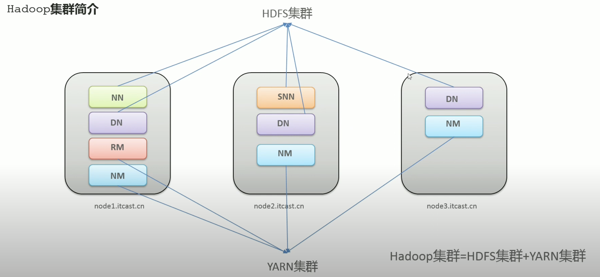
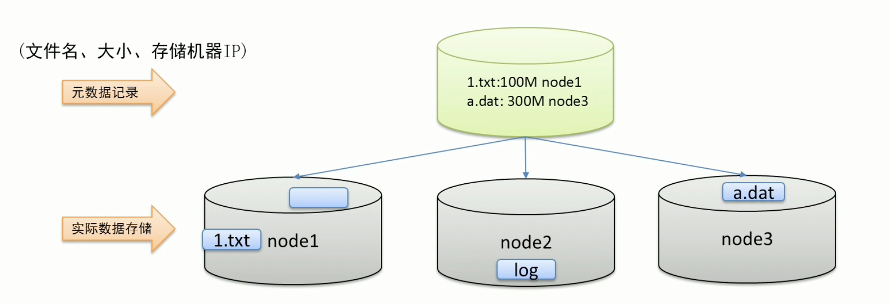
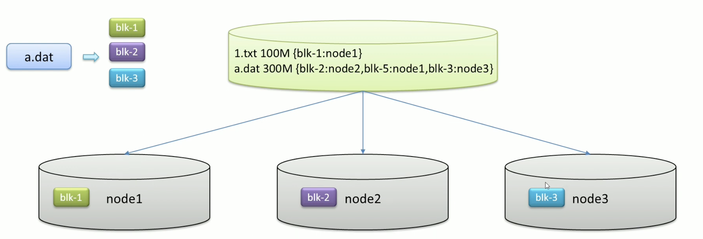
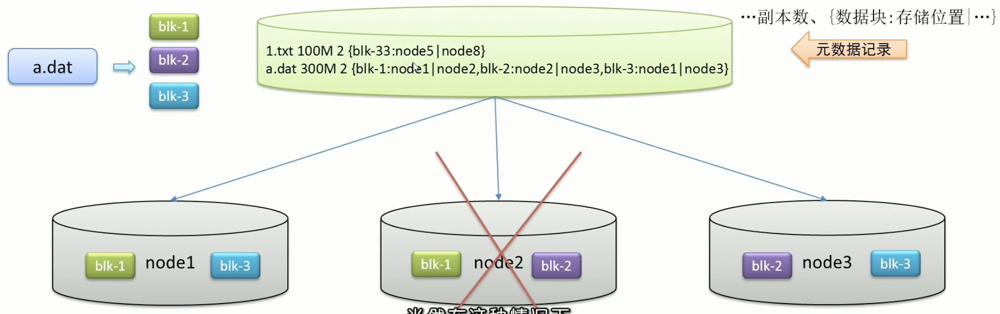
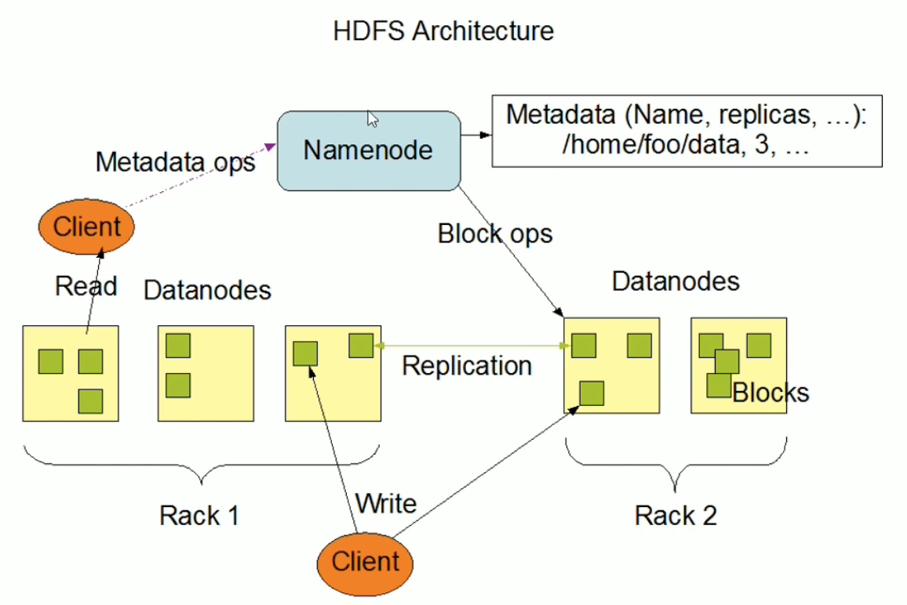

# HDFS

---

[【黑马程序员】大数据Hadoop入门教程-Apache Hadoop、HDFS-05-Apache Hadoop安装部署--集群组成介绍](https://www.youtube.com/watch?v=Im_EEtEucE8&list=PLFbd8KZNbe-_hl4cLftTLwA4THNSLhB10&index=24&ab_channel=%E9%BB%91%E9%A9%AC%E7%A8%8B%E5%BA%8F%E5%91%98)

## Hadoop 三大組件

1. HDFS: 解決數據儲存
2. YARN: 解決資源管理、任務調度
3. MapReduce: 進行程序計算

物理層面上只有兩個: HDFS、YARN

## Hadoop 兩大集群

特性:

- 兩個集群**邏輯上分離，物理上在一起**
    - 邏輯上分離：相互獨立，沒有一定要啟動一個才能啟動另一個
    - 物理上一起：某些角色會部署在同一台機器上
- 兩個集群都是標準的**主從架構**集群 (大哥帶小弟幹活)



### HDFS 集群 (分散式存儲系統)

1. NameNode, NN (主角色)
2. DataNode, DN (從角色)
3. SecondaryNameNode, SNN (主角色輔助角色)

### YARN 集群 (資源管理、任務調度)

1. ResourceManager, RM (主角色)
2. NodeManager, NM (從角色)

### 有沒有 MapReduce 集群？

沒有，MapReduce 是計算框架 (代碼層面的組件)。

---

[【黑马程序员】大数据Hadoop入门教程-Apache Hadoop、HDFS-11-Apache Hadoop安装部署--初体验](https://www.youtube.com/watch?v=AwyDhNm42Ew&list=PLFbd8KZNbe-_hl4cLftTLwA4THNSLhB10&index=30&ab_channel=%E9%BB%91%E9%A9%AC%E7%A8%8B%E5%BA%8F%E5%91%98)

## HDFS 初體驗

```
hadoop fs -mkdir /emma
hadoop fs -put note.txt /emma
hadoop fs -ls /
```

- 為什麼上傳一個小文件也這麼慢？

## MapReduce + YARN 初體驗

```
# 計算圓周率
hadoop jar hadoop-mapreduce-examples-3.3.0.jar pi 2 2

# 計算字母數
hadoop jar hadoop-mapreduce-examples-3.3.0.jar wordcount /wordcount/input /wordcount/output
```

- 執行後先找 ResouceManager 要資源
- 分兩階段：先 Map 再 Reduce
- 處理小數據，MapReduce 速度慢

---

[【黑马程序员】大数据Hadoop入门教程-Apache Hadoop、HDFS-13-场景互动：分布式存储系统的核心属性及功能作用](https://www.youtube.com/watch?v=j24b_nN0WKo&list=PLFbd8KZNbe-_hl4cLftTLwA4THNSLhB10&index=32&ab_channel=%E9%BB%91%E9%A9%AC%E7%A8%8B%E5%BA%8F%E5%91%98)

## 分散式儲存系統的核心屬性及功能作用

### 分散式儲存系統的核心屬性

1


2



3



4



1. 分散式儲存
    - 解決: 數據量大，單機儲存遇到瓶頸
        - **多機橫向擴展**：機器不夠加機器，理論上**無限擴展**
        - vs 單機縱向擴展：硬碟不夠加硬碟，有上限瓶頸
2. 元數據 (後設資料, metadata) 紀錄
    - 解決: 文件分布在不同機器上不利尋找
        - 元數據紀錄文件及儲存位置訊息，**快速定位文件位置**
3. 分塊儲存 (區塊儲存)
    - 解決: 文件過大導致單機存不下、上傳下載效率低
        - 文件分塊儲存在不同機器，**針對塊並行操作提高效率**
4. 副本機制
    - 解決: 硬件故障難以避免，數據易丟失
        - 不同機器設置備份，**冗余儲存**，保障數據安全

---

[【黑马程序员】大数据Hadoop入门教程-Apache Hadoop、HDFS-14-HDFS简介、设计目标与应用场景](https://www.youtube.com/watch?v=0gsaxDRXPBg&list=PLFbd8KZNbe-_hl4cLftTLwA4THNSLhB10&index=33&ab_channel=%E9%BB%91%E9%A9%AC%E7%A8%8B%E5%BA%8F%E5%91%98)

## HDFS 簡介

- Hadoop Distributed File System (HDFS)
- 橫跨在**多台機器**上的儲存系統
- 對外提供**統一的訪問接口**，像是訪問一個普通文件系統一樣使用分散式文件系統

## HDFS 起源發展

- **Doug Cutting** 領導 Nutch 項目研發，設計全網搜尋引擎
- 為了要**解決數十億網頁的儲存和索引問題**
- 2003年，Google 發表可行的解決方案: **分布式文件系統 (GFS)**
- Nutch 的開發人員完成相應的開源實現 HDFS

## HDFS 設計目標

- **故障檢測**和**自動快速恢復**
- 相較於數據訪問的反應時間，更注重數據訪問的**高吞吐量**
    - 適合 Large datasets
- **Write-one-read-many (一次寫入多次讀取) 訪問模型**: 不支援文件編輯
    - 概念: 數據一旦寫到 HDFS 上面，就很少修改
- **移動計算的代價比移動數據的代價低**
- HDFS 被設計為**可以從一個平台輕鬆移植到另一個平台**，有助將 HDFS 用作大量應用程序的首選平台

## HDFS 應用場景

適合:

- 大文件
- 數據流式訪問
- 一次寫入多次讀取
- 低成本部署，廉價 PC
- 高容錯

不適合:

- 小文件
- 數據交互式訪問
- 頻繁任意修改
- 低延遲處理

---

[【黑马程序员】大数据Hadoop入门教程-Apache Hadoop、HDFS-15-HDFS重要特性解读](https://www.youtube.com/watch?v=sUhjlBru0aE&list=PLFbd8KZNbe-_hl4cLftTLwA4THNSLhB10&index=34&ab_channel=%E9%BB%91%E9%A9%AC%E7%A8%8B%E5%BA%8F%E5%91%98)

## HDFS 重要特性解讀



### 1. 主從架構

- Master/Slave (MS) 架構
- 一個 NameNode + 多個 DataNode 組成
    - NameNode: HDFS 主節點，維護元數據、維護目錄結構
    - DataNode: HDFS 從節點，管理數據塊、匯報 NameNode

### 2. 分塊儲存

- 物理上分塊 (block) 儲存，預設 128MB，不足 128MB 本身就是一塊
- 塊的大小可以透過 `dfs.blocksize` 設定

### 3. 副本機制

- 所有的 Block 都會有副本，預設值是 `3` → `1` (原本的) +`2` (副本)
- 副本的數量可以透過 `dfs.replication` 設定

### 4. 元數據管理

在 HDFS 中，NameNode 管理的元數據有兩種類型

1. 文件自身屬性訊息: 文件名稱、權限、修改時間、文件大小、複製因子、數據塊大小
2. 文件塊位置映射訊息: 文件塊和 DataNode 之間的映射訊息 (e.g., 哪個塊位於哪個節點上)

### 5. Namespace

- 支援傳統的層次型文件組織結構，用戶可以創建、刪除、移動或重命名文件
- NameNode 負責維護文件系統的 Namespace，任何對文件系統命名空間或屬性的修改都將被 NameNode記下
- HDFS 會提供客戶端一個統一的抽象目錄樹 (i.e., `hdfs://[namenode]:[port]/dir-a/dir-b/dir-c/file.data`)

### 6. 數據塊存儲

- 文件各個 Block 的具體存儲管理由 DataNode 節點負責
- 一個 Block 都可以在多個 DataNode 上存儲

---

[【黑马程序员】大数据Hadoop入门教程-Apache Hadoop、HDFS-16-HDFS shell命令行解释说明](https://www.youtube.com/watch?v=ZhI823V2-Lw&list=PLFbd8KZNbe-_hl4cLftTLwA4THNSLhB10&index=35&ab_channel=%E9%BB%91%E9%A9%AC%E7%A8%8B%E5%BA%8F%E5%91%98)

## HDFS Shell 指令解釋

### 文件系統協議

- HDFS Shell CLI 支援多種文件系統
- 取決於指令 URL 中的前綴協議
- 如果沒指定前綴，將讀取環境變數中的 `fs.defaultFS` (`core-site.xml`)，作為預設文件系統

```
# 操作本地文件系統
hadoop fs -ls [file:///]

# 操作 HDFS 分散式文件系統
hadoop fs -ls [hdfs://node1:8020/]

# 直接跟目錄，沒有指定協議，讀取 `fs.defaultFS` 值
hadoop fs -ls [/]
```

---

[【黑马程序员】大数据Hadoop入门教程-Apache Hadoop、HDFS-17-HDFS shell命令行常用操作](https://www.youtube.com/watch?v=BmOTLPuNpKo&list=PLFbd8KZNbe-_hl4cLftTLwA4THNSLhB10&index=36&ab_channel=%E9%BB%91%E9%A9%AC%E7%A8%8B%E5%BA%8F%E5%91%98)

## HDFS Shell 指令常用操作

```
# 創建文件夾
hadoop fs -mkdir (-p) [path]

# 查看指定目錄下的內容
hadoop fs -ls (-h) (-R) (path)

# 上傳文件到 HDFS 指定目錄下
hadoop fs -put [localSrc] [dst]

# 查看 HDFS 文件內容
hadoop fs -cat [path]

# 下載 HDFS 文件
hadoop fs -get (-f) (-p) [path] [localSrc]

# 複製 HDFS 文件
hadoop fs -cp (-f) [src] [dst]

# 追加數據到 HDFS 文件中
hadoop fs -appendToFile [localSrc] [dst]

# HDFS 數據移動操作
hadoop fs -mv [src] [dst]
```

---

[【黑马程序员】大数据Hadoop入门教程-Apache Hadoop、HDFS-18-HDFS工作流程与机制--各角色职责介绍与梳理](https://www.youtube.com/watch?v=O1_LsrxSomg&list=PLFbd8KZNbe-_hl4cLftTLwA4THNSLhB10&index=37&ab_channel=%E9%BB%91%E9%A9%AC%E7%A8%8B%E5%BA%8F%E5%91%98)

## HDFS 集群角色與職責

### NameNode

- Hadoop 的核心，架構中的主角色
- NameNode **維護和管理文件系統元數據** (e.g., Namespace 目錄數建構、文件和塊的位置訊息、訪問權限等訊息)，不存實際數據
- **訪問 HDFS 的唯一入口**
- 不持久存儲每個文件中各個塊所在的 DataNode 的位置訊息 (由小弟匯報)
- NameNode 機器通常會配置**大量內存** (RAM)
- Hadoop 及群中的單點故障

### DataNode

- Hadoop 的從角色，負責**具體數據存儲**
- **數量決定 HDFS 整體數據存儲能力**
- 啟動後，會**將自己註冊到 NameNode** 並匯報自己負責持有的 Block
- DataNode 機器通常會配置**大量硬碟空間**
- 某個 DataNode 關閉不會影響數據的可用性，NameNode 會安排其他 DataNode 管理的 Block 進行副本複製

### SecondaryNameNode

- 不能替代 NameNode
- 協助 NameNode 進行元數據的合併 (NameNode 的秘書)