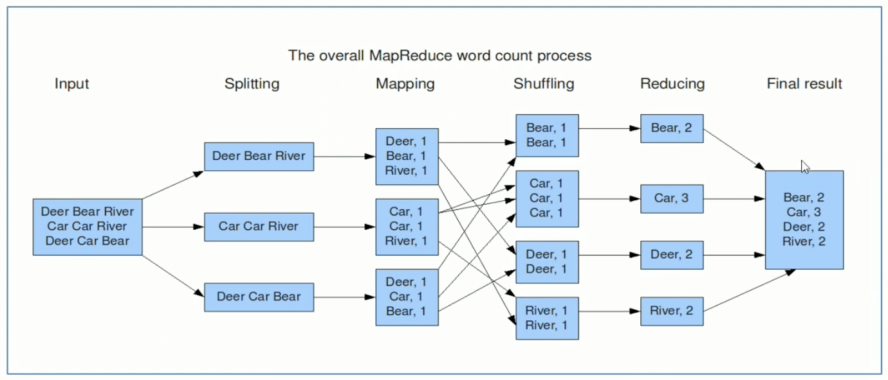
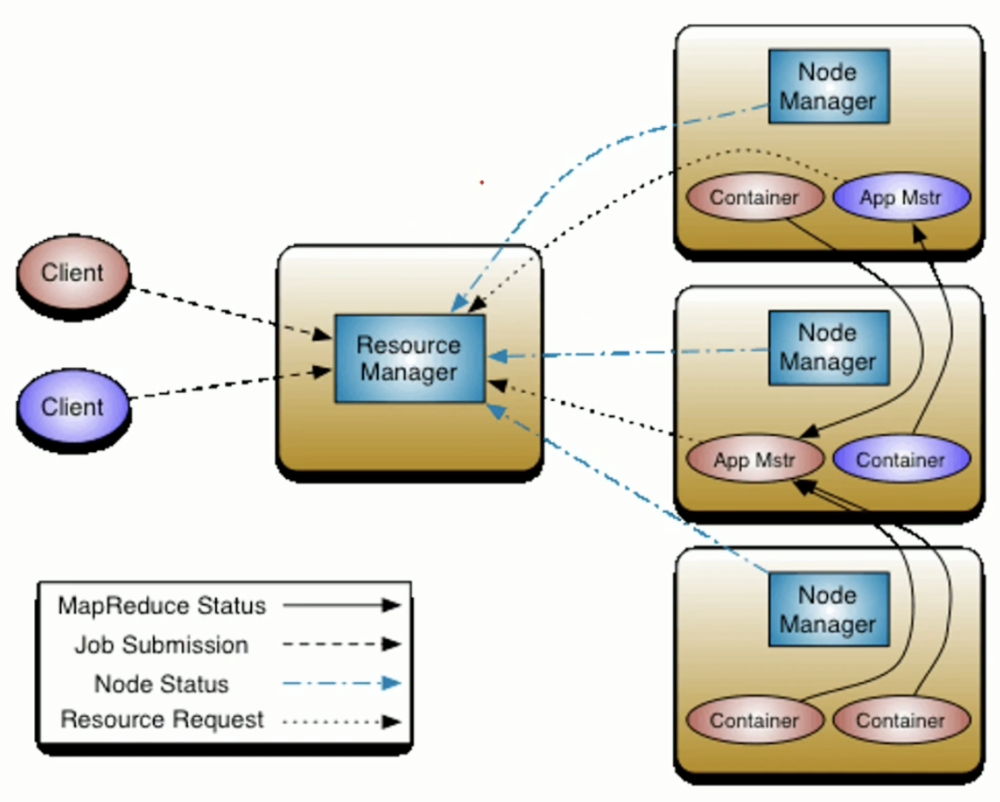
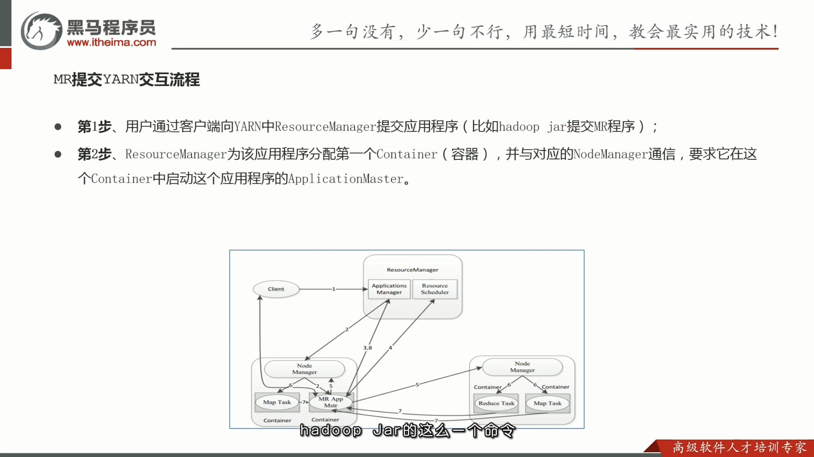
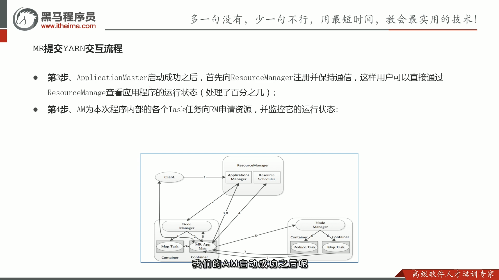
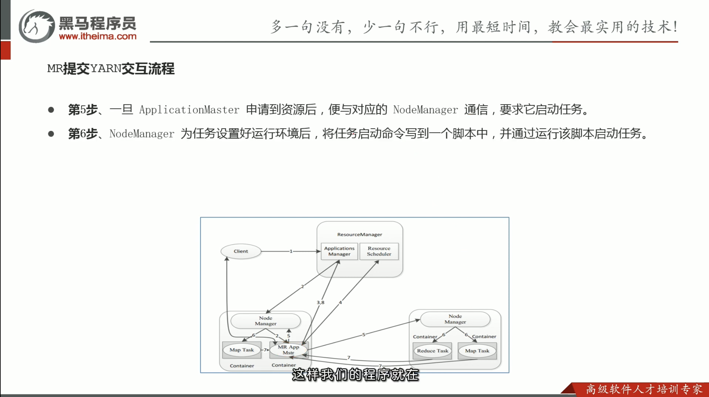
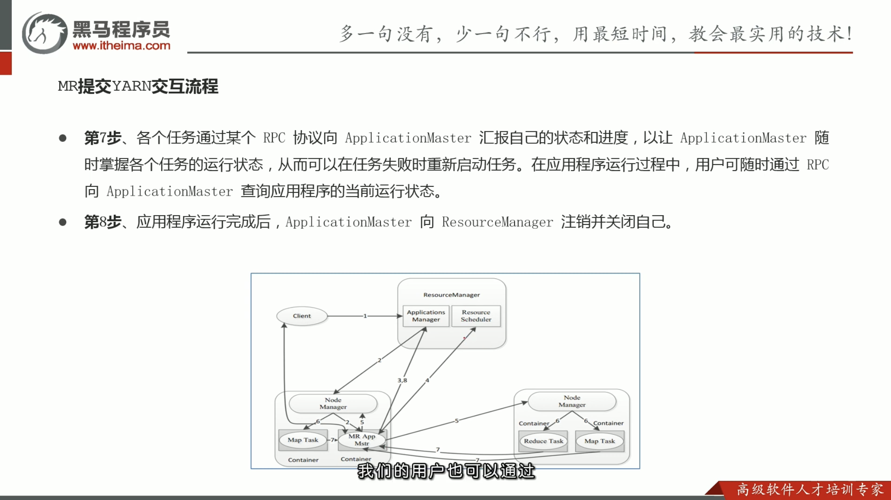

# YARN

---

[【黑马程序员】大数据Hadoop入门教程-MapReduce与YARN-01-理解先分再合、分而治之的思想](https://www.youtube.com/watch?v=3JAlhOA1XQY&list=PLFbd8KZNbe-_hl4cLftTLwA4THNSLhB10&index=41&ab_channel=%E9%BB%91%E9%A9%AC%E7%A8%8B%E5%BA%8F%E5%91%98)

## 理解 MapReduce 思想

- 先分再合，分而治之

### 第一階段: Map

- 負責拆分，把複雜任務**分解為若干個「簡單的子任務」來並行處理**
- 拆分前提是彼此間幾乎**沒有依賴關係**

### 第二階段: Reduce

- 對 Map 階段的結果進行匯總

---

[【黑马程序员】大数据Hadoop入门教程-MapReduce与YARN-05-Hadoop MapReduce官方示例-WordCount单词统计](https://www.youtube.com/watch?v=efOF9KEoKvQ&list=PLFbd8KZNbe-_hl4cLftTLwA4THNSLhB10&index=45&ab_channel=%E9%BB%91%E9%A9%AC%E7%A8%8B%E5%BA%8F%E5%91%98)

## WordCount 單詞統計

### 編程實現思路

### Map 階段核心

- 把輸入的數據經過切割，全部標記1
- MR 框架數據類型要求都是 Key/Value

### Shuffle 階段核心

- 經過 MR 程序內部預設的排序分組等功能，把 key 相同的單詞會作為一組數據構成新的 Key/Value

### Reduce 階段核心

- 對所有的1進行累加求和

---

[【黑马程序员】大数据Hadoop入门教程-MapReduce与YARN-09-Hadoop YARN-功能介绍-资源管理、任务调度](https://www.youtube.com/watch?v=l6T3QfDlyMA&list=PLFbd8KZNbe-_hl4cLftTLwA4THNSLhB10&index=49&ab_channel=%E9%BB%91%E9%A9%AC%E7%A8%8B%E5%BA%8F%E5%91%98)

## 資源管理、任務調度

### YARN 介紹

- Yet Another Resource Negotiator (YARN)
- **通用**的**資源管理系統**和**調度平台**
    - 資源管理系統：集群的硬體資源，如記憶體、CPU (硬碟由 HDFS 管理)
    - 調度平台：按造某種規則分配資源
    - 通用：理論上支持各種計算程序 (MapReduce, Spark, ...)，YARN 不關心你幹什麼，只關心你要資源，在有的情況下給你，用完之後還我
- 可以把 Hadoop YARN 理解為一個分散式的操作系統平台

---

[【黑马程序员】大数据Hadoop入门教程-MapReduce与YARN-10-Hadoop YARN-架构图、3大组件介绍](https://www.youtube.com/watch?v=Hp1NevritI4&list=PLFbd8KZNbe-_hl4cLftTLwA4THNSLhB10&index=50&ab_channel=%E9%BB%91%E9%A9%AC%E7%A8%8B%E5%BA%8F%E5%91%98)

## YARN 官方架構圖

## YARN 三大組件

- ResourceManager, NodeManager -> 集群物理層面
- ApplicationMaster (App Mstr) -> App 層面 (程序內部的老大)

### ResourceManager (RM)

- 集群的主角色
- 資源分配的最終仲裁者

### NodeManager (NM)

- 管理本機器上的計算資源
- 根據 RM 命令，啟動 Container 容器
- 向 RM 匯報資源使用情況

### ApplicationMaster (AM)

- 每一個用戶提交的應用程序均包含一個 AM
- 應用程序內的老大，監督程序執行情況

## YARN 其他組件

- Client
- Container 容器 (資源的抽象): 在一台機器上運行多個程序如何確保程序之間是隔離的

---

[【黑马程序员】大数据Hadoop入门教程-MapReduce与YARN-11-Hadoop YARN-程序提交YARN集群交互流程](https://www.youtube.com/watch?v=GWY9jgmTa2Y&list=PLFbd8KZNbe-_hl4cLftTLwA4THNSLhB10&index=51&ab_channel=%E9%BB%91%E9%A9%AC%E7%A8%8B%E5%BA%8F%E5%91%98)

## 核心交互流程

- MR 作業提交: Client -> RM
- 資源的申請: MrAppMaster -> RM
- MR 作業狀態匯報: Container (Map/Reduce Task) -> Container (MrAppMaster)
- 節點的狀態匯報: NM -> RM

## 整體概述

用戶向 YARN 中提交一個應用程序後

1. 用戶端**申請資源**，啟動運行本次程序的 ApplicationMaster
2. 由 ApplicationMaster 根據本次程序內部具體情況**申請資源**，並監控它的整個運行過程

## MapReduce 提交 YARN 交互流程

